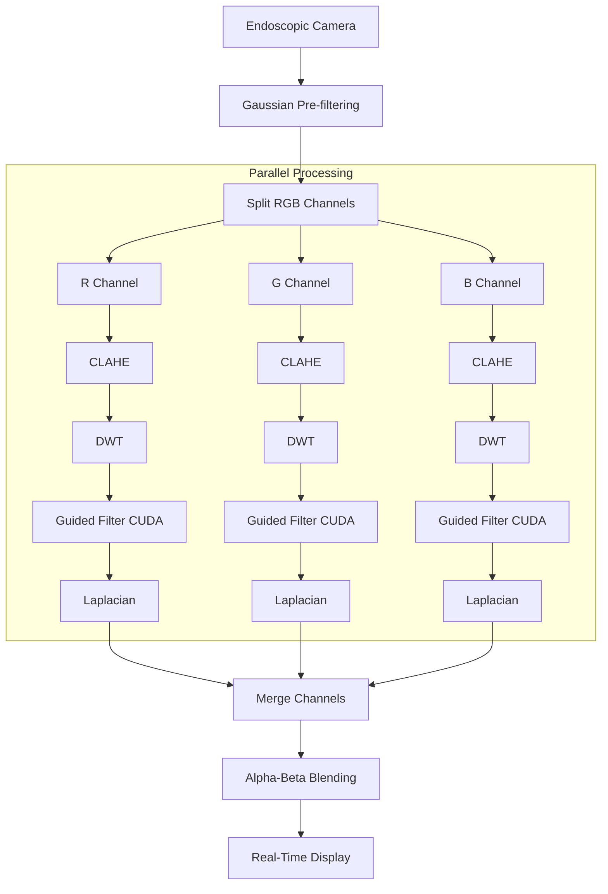
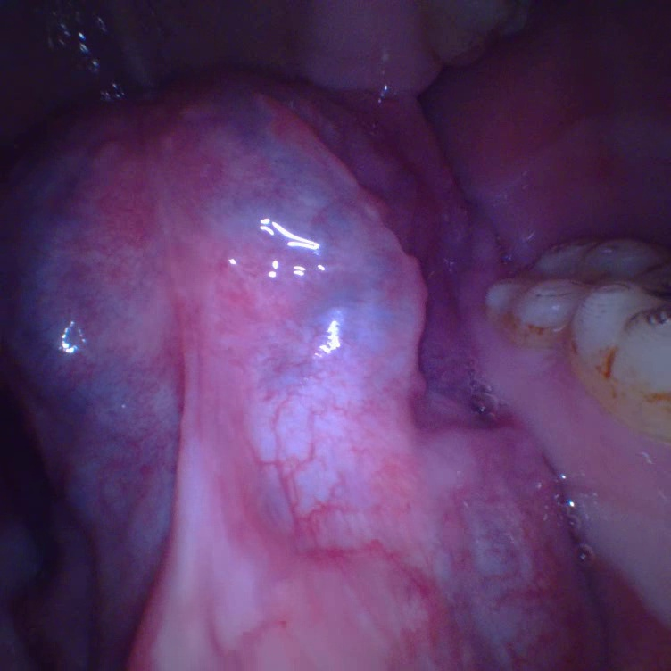
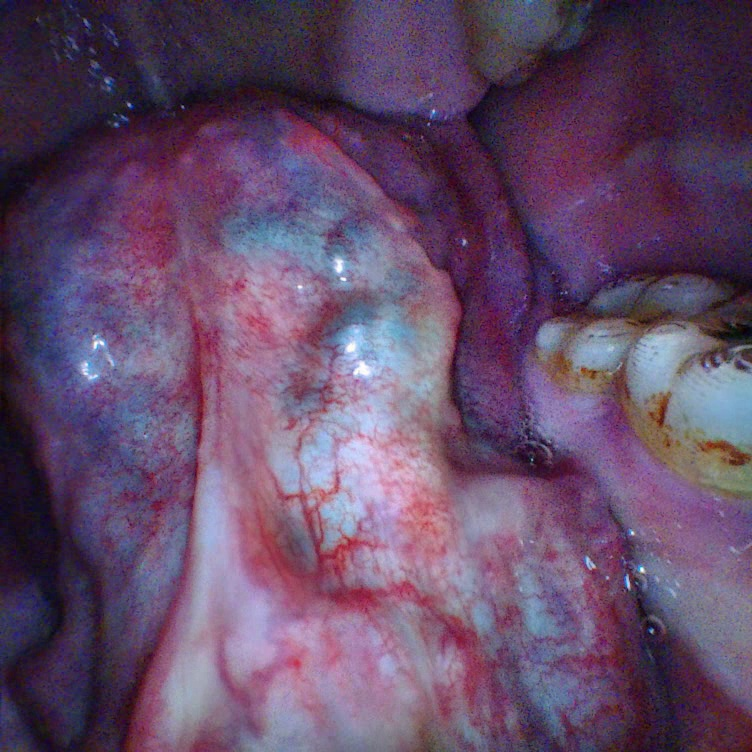
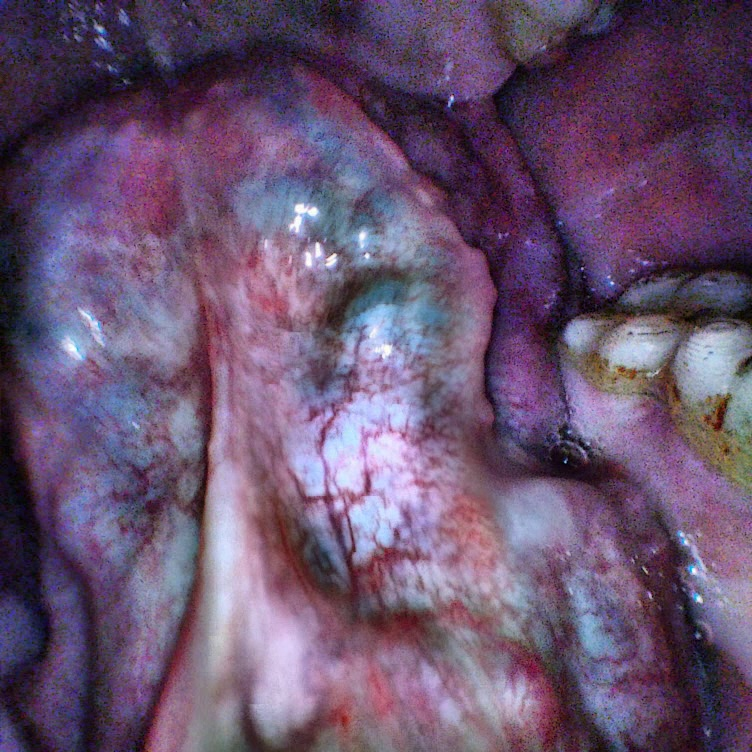

# Real-Time Endoscopic Image Enhancement System
### CUDA-Accelerated & Multi-Threaded C++ Medical Imaging Pipeline

> A high-performance endoscopic image enhancement pipeline optimized for real-time medical video processing using modern C++, NVIDIA CUDA, and multi-threaded concurrency.

> **Note**
> Due to intellectual property protections and non-disclosure agreements (NDA), the source code for this project cannot be publicly released. This repository documents the system architecture, implementation details, optimization strategies, and engineering contributions.

---

## Overview

This project was developed during my software engineering internship and focuses on transforming a high-latency Python prototype into a deployment-oriented C++ application capable of real-time endoscopic video enhancement.

The original implementation processed a **1280×720** frame in approximately **3.52 seconds**, making live visualization impossible. Through algorithmic refactoring, custom mathematical implementations, GPU acceleration using NVIDIA CUDA, and multi-threaded concurrency, the processing latency was reduced to approximately **35 ms per frame**, achieving nearly **30 FPS** real-time performance.

Rather than focusing solely on algorithm implementation, this project emphasizes **high-performance software engineering**, including system optimization, hardware acceleration, dependency management, modular software architecture, and real-time image processing.

---

# Project Highlights

- Refactored a legacy Python prototype into modern C++
- Achieved over **100× speed improvement**
- NVIDIA CUDA accelerated image processing
- Multi-threaded pipeline using `std::thread`
- Real-time processing for live endoscopic video streams
- Implemented custom Discrete Wavelet Transform (DWT) and Guided Filter modules from scratch
- Built a configurable GUI supporting runtime parameter adjustment
- Generated DLL modules for deployment across multiple systems

---

# My Contributions

During this project, I was responsible for:

- Rewriting the original Python image processing pipeline in modern C++
- Implementing custom mathematical modules including Discrete Wavelet Transform (DWT) and Guided Filtering
- Accelerating computational bottlenecks using NVIDIA CUDA
- Designing a multi-threaded image processing framework with `std::thread`
- Building an interactive GUI for real-time parameter tuning
- Optimizing the complete pipeline from **0.28 FPS** to nearly **30 FPS**
- Configuring the OpenCV + CUDA + CMake development environment
- Packaging the application as a Dynamic Link Library (DLL) for deployment

---

# System Architecture



---

# Image Enhancement Pipeline

The enhancement pipeline consists of multiple complementary stages designed to improve visualization while preserving anatomical structures.

## Gaussian Pre-filtering

Suppresses sensor noise before nonlinear enhancement to prevent amplification of high-frequency artifacts.

## CLAHE

Contrast Limited Adaptive Histogram Equalization improves local contrast while preventing over-enhancement caused by traditional histogram equalization.

## Discrete Wavelet Transform (DWT)

Separates illumination information from structural details, allowing different frequency components to be processed independently.

## Guided Filter

Preserves fine image boundaries while smoothing noise, reducing halo artifacts commonly introduced by traditional edge-preserving filters.

## Laplacian Sharpening

Enhances local edge responses to improve structural visibility.

## Alpha-Beta Blending

Blends enhanced textures with the original image, allowing dynamic adjustment between natural appearance and enhanced visualization.

---

# Multi-Mode Visualization

The application supports multiple enhancement modes that can be switched dynamically during runtime.

| Mode | Description |
|-------|-------------|
| Mode 0 | Original endoscopic video |
| Mode 1 | RGB-space CLAHE enhancement |
| Mode 2 | HSV V-channel preprocessing + RGB enhancement |

Example comparison:

| Original | Mode 1 | Mode 2 |
|----------|---------|---------|
|  |  |  |

Mode 1 provides balanced contrast enhancement while preserving natural color appearance.

Mode 2 applies an additional CLAHE pass on the HSV Value channel before RGB enhancement, further emphasizing local structural contrast and fine vascular patterns.

---

# Technical Implementation

## Algorithmic Optimization

Because standard C++ libraries do not provide native implementations of several required image processing algorithms, multiple mathematical modules were implemented from scratch.

Implemented modules include:

- Discrete Wavelet Transform (DWT)
- Guided Filter
- Image reconstruction
- Mathematical optimization routines

---

## GPU Acceleration

GPU acceleration was implemented using NVIDIA CUDA.

Computational bottlenecks—including repeated matrix operations and computationally intensive OpenCV routines—were migrated to CUDA kernels, significantly reducing execution latency.

---

## Multi-Threaded Processing

To maximize CPU utilization, image channels are processed concurrently using `std::thread`.

Each thread coordinates GPU-accelerated processing for one color channel before synchronization and reconstruction.

---

## GUI & Runtime Controls

The application includes an interactive GUI supporting:

- CLAHE parameters
- Filter kernel sizes
- Enhancement strength
- Visualization mode selection
- Side-by-side comparison
- Dual-stream display

All parameters can be adjusted during runtime without restarting the application.

---

# Performance Benchmark

## Benchmark Environment

| Item | Specification |
|------|---------------|
| Resolution | 1280 × 720 |
| Language | C++ |
| GPU | NVIDIA CUDA |
| Framework | OpenCV |
| Build System | CMake |
| Compiler | Visual Studio |

---

## Performance

| Stage | Time / Frame | FPS |
|---------|-------------|------|
| Python Prototype | 3.52 s | 0.28 |
| Initial C++ Version | 1.48 s | 0.68 |
| CUDA + Multi-threading | 0.035 s | 28.6 |

### Performance Improvement

- **Latency reduced by over 99%**
- **More than 100× speed improvement**
- **Real-time visualization achieved**
- **Stable processing at nearly 30 FPS**

---

# Engineering Challenges

## Custom Mathematical Implementations

Several required algorithms were unavailable in standard C++ libraries.

Core mathematical modules—including DWT and Guided Filtering—were implemented independently based on algorithmic principles and optimized for real-time execution.

---

## CUDA Development Environment

Built an OpenCV + CUDA + CMake development environment from scratch while resolving dependency and version compatibility issues across multiple development machines.

---

## Cross-System Deployment

Packaged the application as a Dynamic Link Library (DLL) and successfully deployed it across different hardware environments while maintaining OpenCV version compatibility.

---

# Key Learnings

Throughout this project I gained practical experience in:

- High-performance C++ programming
- GPU computing with NVIDIA CUDA
- Multi-threaded software architecture
- Medical image enhancement
- OpenCV source compilation
- CMake project configuration
- DLL deployment
- Real-time video processing
- Engineering optimization for production-scale systems

---

# Limitations

This repository summarizes the engineering implementation of the project rather than providing source code.

Current evaluation focuses primarily on computational performance and visualization quality.

No clinical validation or diagnostic claims are made, and further evaluation on diverse datasets would be required for medical deployment.

---

# Technologies

- C++
- CUDA
- OpenCV
- OpenCV Contrib
- CMake
- Visual Studio
- Multi-threading (`std::thread`)
- DWT
- Guided Filter
- CLAHE
- Image Processing
- Medical Imaging

---

# Repository Structure

```
README.md
mode0.jpg
mode1.jpg
mode2.jpg
architecture.png
```

---

# License

The implementation described in this repository was completed during an industrial internship.

Source code is proprietary and cannot be publicly released due to intellectual property protection and non-disclosure agreements.

This repository is intended solely for documentation and portfolio purposes.
