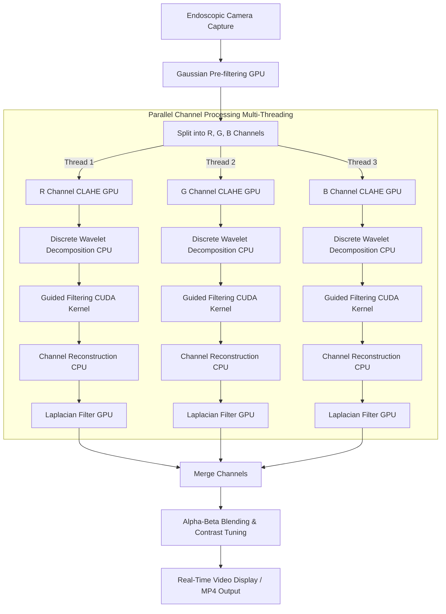

# Real-Time Endoscopic Image Enhancement System via CUDA & Multi-Threaded C++

## Project Overview
This repository details the architecture, optimization strategies, and performance benchmarks of a high-performance medical video processing pipeline designed for real-time endoscopic procedures. The core objective was to refactor a legacy, high-latency Python prototype into a production-ready C++ application capable of processing high-resolution video streams with zero perceptible lag.

By implementing custom mathematical algorithms, utilizing hardware acceleration via NVIDIA CUDA, and executing multi-threaded concurrency, the system's processing speed was accelerated significantly, achieving real-time performance of nearly 30 FPS for 1280x720 video streams.

***Due to intellectual property protections and non-disclosure agreements, the source code for this project is proprietary and cannot be shared publicly. This document serves as a comprehensive architectural and engineering summary of the implementation.***

---

## System Architecture & Pipeline Flowchart

The system ingests sequential video frames from an endoscopic camera device. To achieve maximum processing efficiency, the framework splits individual color channels and handles computationally intensive operations across parallel CPU threads and GPU kernels.

## Technical Implementation Details

### 1. Algorithmic Refactoring & Mathematical Optimization
* **Hand-Crafted Mathematical Modules:** Because standard C++ libraries lack native support for Discrete Wavelet Transforms (DWT) and Guided Filtering, these components were engineered entirely from scratch.
* **Function-Level Acceleration:** The core algorithm's internal execution path was optimized using mathematical logic and structural consolidation to minimize computational redundancy and reduce per-frame execution time.

### 2. Hardware Acceleration via NVIDIA CUDA
* **Environment Architecture:** Configured a high-performance development environment from the ground up using Visual Studio, CMake, OpenCV (including `opencv_contrib`), and the NVIDIA CUDA toolkit.
* **GPU-Accelerated Matrix Operations:** Offloaded heavily repeated operations—specifically matrix computations within the Guided Filter and native OpenCV functions—directly onto GPU kernels to bypass sequential CPU execution bottlenecks.

### 3. Multi-Threaded Concurrency
* **Parallel Channel Processing:** Because sequential processing of individual image channels using standard loops was highly inefficient, the pipeline splits the frame into three discrete channels and processes them simultaneously.
* **Threaded Acceleration:** Utilizing `std::thread`, three concurrent CPU threads execute image enhancement tasks in parallel, maximizing multi-core processor efficiency and enabling high-throughput streaming.

### 4. Dynamic Parameter Control & User Interface
* **Interactive Control Panel:** Designed an updated real-time runtime application that integrates a graphical user interface (UI) with trackbars, allowing operators to dynamically adjust algorithmic parameters on the fly.
* **Configurable Optimization Pipelines:** Users can interactively tune parameters such as thresholding limits, filter kernels, and visualization modes (e.g., side-by-side comparison or dual-lens stream views).
* **V-Channel Contrast Enhancement:** Integrated an optional pipeline expansion that applies Contrast Limited Adaptive Histogram Equalization (CLAHE) specifically to the V (Value) channel within the HSV color space for enhanced detail visualization.

## Quantitative Performance Indicators

Through structural algorithmic refactoring, hardware acceleration, and concurrency tuning, the system achieved a massive reduction in frame processing latency, successfully enabling smooth, real-time visualization.

| Optimization Phase | Execution Time Per Frame (1280x720) | Equivalent Frame Rate (FPS) | Performance Gain |
| :--- | :--- | :--- | :--- |
| **Python Prototype (Baseline)** | 3.52 seconds | ~0.28 FPS | Baseline |
| **Naive C++ Port (Logic Tweaks)** | 1.48 seconds | ~0.68 FPS | 2.38x Acceleration |
| **CUDA + Multi-Threaded C++** | 0.035 seconds | ~28.6 FPS | **100.57x Acceleration** |

### Core Benchmarks & Key Metrics
* **Latency Reduction:** Frame processing time for a standard 1280x720 resolution stream dropped from 3.52 seconds to 1.48 seconds after basic C++ logic modifications, and was ultimately minimized to 0.35 seconds through advanced acceleration.
* **Real-Time Throughput:** By shifting critical matrix computations to the GPU and implementing multi-threaded processing while omitting non-essential Super-Resolution overhead, the pipeline maintains a consistent throughput of nearly 30 FPS.
* **Dynamic Resolution Scalability:** The framework delivers lag-free, real-time processing across various endoscopic instruments by dynamically adjusting the pre-processing magnification scale based on the target camera's input resolution.

## Engineering Challenges & Key Learnings

### Technical Challenges & Bottleneck Resolution

* **Low-Level Algorithmic Reconstruction:** While the initial prototype relied heavily on high-level Python built-in functions, standard C++ libraries lacked native modules for Discrete Wavelet Transforms (DWT) and Guided Filtering. I engineered these core mathematical functions entirely from scratch, overcoming the obstacle of sparse online reference documentation.
* **Complex Dependency & Version Compatibility:** Establishing the high-performance development ecosystem presented significant configuration challenges. I successfully built a unified runtime pipeline integrating Visual Studio, OpenCV, and the NVIDIA CUDA toolkit from the ground up, resolving complex version compatibility conflicts and overcoming environment disparities between desktop and laptop hardware that caused standard tutorials to fail.
* **Cross-Platform Dynamic Library Deployment:** To prepare the product for commercial vendor delivery, the framework had to be compiled on a desktop workstation as a Dynamic Link Library (DLL) and successfully deployed on a target testing laptop. This required managing strict environment synchronization and OpenCV version parity across devices to prevent critical linking failures during execution.

### Key Learnings & Skill Acquisition

* **Hardware Acceleration & Concurrency:** Gained hands-on expertise in GPU-accelerated computing via CUDA kernels and multi-threaded parallel processing using `std::thread` to maximize hardware processing throughput.
* **Custom Source Compilation:** Mastered low-level build configurations by utilizing CMake to build and compile OpenCV and `opencv_contrib` from source, unlocking advanced GPU and hardware-optimization modules.
* **Real-Time Signal Ingestion:** Acquired practical engineering experience interfacing with specialized medical hardware, successfully capturing, reading, and streaming live endoscopic video input.
* **High-Performance Image Enhancement:** Deployed production-grade video processing pipelines optimized for real-time visualization and boundary/edge reinforcement.
* **Modular Software Architecture:** Mastered the concepts of dynamic linking by building custom DLLs for cross-environment integration and explored cross-platform GUI application workflows using the Qt framework.
